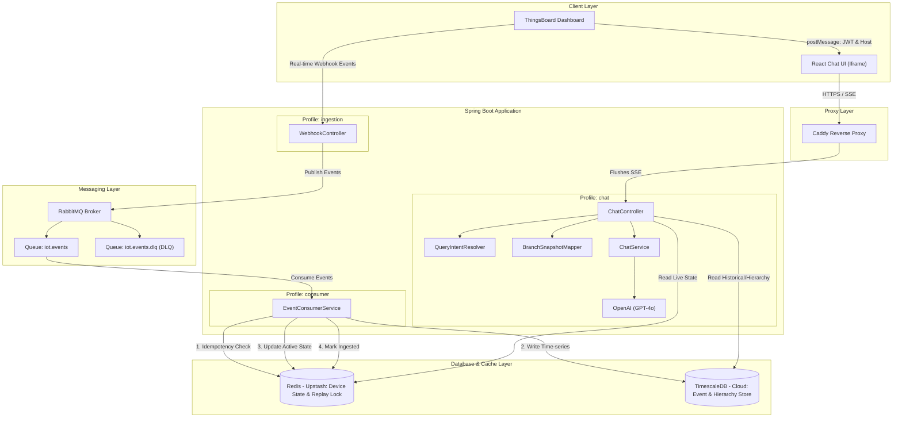

# ThingsBoard AI IoT Assistant (SAI) 

<div align="center">

[](https://github.com)
[](LICENSE)
[](https://github.com)
[](https://oracle.com/java)
[](https://spring.io)

## **Your IoT Data, Simplified. Ask. Analyze. Act. Done.**

Tired of navigating complex IoT dashboards? **We've built the "Siri" for your ThingsBoard network.**  
Real-time status reports, automated health checks, and intelligent security analysis — all through a simple chat interface.

---

### Quick Navigation
- **[For Everyone — Show me the overview](#part-1--for-everyone)**
- **[For Developers — Show me the setup](#part-2--for-developers)**

</div>

---

# PART 1 — FOR EVERYONE

*No coding knowledge required. Read this section in ~5 minutes.*

## Table of Contents (Part 1)
1. [What Is This Project?](#what-is-this-project)
2. [The Problem We Solve](#the-problem-we-solve)
3. [How It Works](#how-it-works-simple-explanation)
4. [Key Benefits](#key-benefits)
5. [Who Is This For?](#who-is-this-for)
6. [Frequently Asked Questions](#frequently-asked-questions-non-technical)

---

## What Is This Project?

Imagine you manage a bank with 100 branches, each filled with cameras, alarm panels, and battery backups. To check if everything is working, you usually have to log into a complicated dashboard, click through 10 menus, and read rows of technical numbers.

**What if you could just ask your computer: "Are there any inactive branches?"**

That's exactly what we built. **SAI (Smart Assistant for IoT)** connects directly to your ThingsBoard platform and lets you talk to your facility data in plain English.

---

## The Problem We Solve

**For Security Managers:**
- Manually checking 100+ branches every morning is slow.
- Identifying offline devices requires technical expertise.
- Finding a specific camera fault takes too many clicks.
- Historical data is hard to find and compare.

**Our Solution — a Senior Security Analyst AI that:**
- Instantly identifies offline branches across your entire network.
- Explains complex sensor data (like battery voltage) in simple terms.
- Remembers your previous questions to provide detailed follow-ups.
- Anchors every answer to a specific branch so there's never confusion.
- Automatically suggests follow-up queries based on the current context.

---

## How It Works (Simple Explanation)

```
1. YOU ASK A QUESTION
   → "What is the CCTV status of BALLY BAZAR?"

2. BOT FETCHES TRUTH
   → The bot reads the real-time sensor data from ThingsBoard / Redis.

3. BRAIN ANALYZES
   → The AI looks at the numbers (e.g., "2 of 16 cameras online").

4. PROFESSIONAL REPORT
   → SAI formats a clean response listing the offline cameras by channel:
     "For Branch BALLY BAZAR, CCTV Camera Status is 2 of 16 cameras ONLINE.
      Offline Cameras:
      - Channel 1: 24080129_003352-VMDS
      - CP-UNC-VC21L5C-VMD-LQ (7 units: Channels 5, 7-9, 12-13, 15)..."

5. INTERACTIVE CHIPS
   → SAI offers interactive suggestion chips:
     [What is the power status of BRANCH BALLY BAZAR?]
     [Are there any active alarms for BRANCH BALLY BAZAR?]
```

---

## Key Benefits

- **Save Time:** Get a full branch health report in 3 seconds instead of 10 minutes.
- **Zero Learning Curve:** If you can send a chat message, you can use SAI.
- **Strict Access Controls:** Users only see branches they are authorized to view (Regional / Zonal / Head Office scoping).
- **Always Fresh Data:** Events flow in real-time from ThingsBoard through RabbitMQ — Redis always reflects current device state.
- **Crash-Safe Pipeline:** Every ingested event is deduplicated and can be safely retried; no data is silently dropped.

---

## Who Is This For?

**Bank & Facility Managers** — Monitor security and hardware health across hundreds of remote locations from one window.

**Security Operations Centers (SOC)** — Quickly identify which branch needs a physical maintenance visit without digging through logs.

**Maintenance Teams** — Ask "What is the HDD status?" before driving to a branch so you know exactly which part to bring.

---

## Frequently Asked Questions (Non-Technical)

**Q: Is my data safe?**  
A: Yes. SAI acts as a "Read-Only" analyst. It cannot change your device settings, and it enforces strict scoping based on your ThingsBoard credentials. An unrecognized account can never see another tenant's data.

**Q: Does it work on my phone?**  
A: Yes. The chat widget works in any modern web browser on desktop, tablet, or smartphone.

**Q: How old is the data?**  
A: The bot shows a "data as of" timestamp with every answer. If the latest reading is older than 10 minutes it is marked stale so you always know how fresh the data is.

---

# PART 2 — FOR DEVELOPERS

*Complete technical documentation, setup guides, and architecture details.*

## Table of Contents (Part 2)
1. [Technical Overview](#technical-overview)
2. [Tech Stack](#tech-stack)
3. [System Architecture](#system-architecture)
4. [Spring Profiles](#spring-profiles)
5. [Security Model](#security-model)
6. [Event Ingestion Pipeline](#event-ingestion-pipeline)
7. [Caching & State Management](#caching--state-management)
8. [Customer & Hierarchy Sync](#customer--hierarchy-sync)
9. [CCTV Formatting](#cctv-formatting--channel-range-grouping)
10. [Getting Started](#getting-started)
11. [Configuration Reference](#configuration-reference)
12. [Data Refresh Runbook](#data-refresh-runbook)
13. [Folder Structure](#folder--file-structure)
14. [Testing](#testing--validation)

---

## Technical Overview

### Architecture Pattern: Context-Augmented Generation (CAG)

SAI is a **Context-Augmented Generation** system. The backend deterministically fetches and validates "Truth" from Redis before the LLM ever sees it, so the AI can only reason about verified, scoped data — it cannot hallucinate device states.

- **Ambiguity Filter:** Detects queries missing a target branch and requests clarification.
- **Topic Retention:** Stores "Pending Intent" in session memory to handle context-heavy follow-ups.
- **Scoping Enforcement:** Every request is filtered to the authenticated customer's authorized node set.
- **Prompt Injection Guard:** User questions are wrapped in `<<<USER_QUESTION>>>` delimiters before being sent to the LLM.

---

## Tech Stack

| Category | Technology | Version | Purpose |
|----------|-----------|---------|---------|
| Backend | Java | 21 | Core language |
| Framework | Spring Boot | 4.0.3 | Application framework |
| Database | TimescaleDB / PostgreSQL | 15+ | Timeseries event store (hypertable + retention) |
| Cache | Redis (Upstash) | 7.x | High-speed active-state mirror |
| Message Broker | RabbitMQ (CloudAMQP) | 3.x | Real-time event ingestion |
| Frontend | React + TypeScript + Vite | 18.x / 5.x | Chat UI |
| Build | Maven | 3.8+ | Dependency management |
| LLM | OpenAI | GPT-4o | Natural language generation |
| Reverse Proxy | Caddy | 2.x | SSE flushing + TLS termination |

---

## System Architecture



---

## Spring Profiles

The application is split into three runtime roles that can be deployed as separate containers or combined:

| Profile | Role | Key beans activated |
|---------|------|---------------------|
| `chat` | Serves the chat API, reads Redis + TimescaleDB | ChatController, CustomerSyncRunner, ReplayService |
| `ingestion` | Receives ThingsBoard webhook events, publishes to RabbitMQ | WebhookController, RabbitMQConfig |
| `consumer` | Consumes RabbitMQ, writes to TimescaleDB + Redis | EventConsumerService, RabbitMQConfig |
| `dev` | Local development overrides | Loads `application-dev.properties` |

Run all roles together locally:
```bash
./mvnw spring-boot:run "-Dspring-boot.run.profiles=dev,chat,ingestion,consumer" \
  "-Dspring-boot.run.arguments=--server.port=8083"
```

See `docs/deployment-topology.md` for multi-container production layout.

---

## Security Model

### Tenant Isolation (fail-closed)
Every JWT claim is decoded to extract the ThingsBoard `customerId`. That UUID is mapped to an internal customer prefix (`BOI`, `SEPL`, etc.) via the `customers` table. If no mapping is found:
- **Production** (`IOTCHATBOT_SECURITY_STRICT_CUSTOMER_MAPPING=true`): throws `UnprovisionedCustomerException` → HTTP 403. No data is returned.
- **Development** (default off): logs a warning and falls back to `BOI` so local testing works without a full DB.

### JWT Signature Verification
Set `IOTCHATBOT_SECURITY_REQUIRE_JWT_VERIFICATION=true` and supply the ThingsBoard signing key in `IOTCHATBOT_JWT_SIGNING_KEY`. At startup the app refuses to boot if the flag is on but the key is blank.

### postMessage Origin Allowlisting
`ChatContext.tsx` validates `event.origin` against an explicit allowlist before accepting any `TB_AUTH_TOKEN` message. Configure via `VITE_TB_ALLOWED_ORIGINS` (comma-separated). The token is held in React state only — never `localStorage` or URL params.

### SSRF Protection (X-TB-Host)
`UserAwareThingsBoardClient` validates the client-supplied `X-TB-Host` header via `ThingsBoardHostValidator`, which performs proper URI-based host extraction and exact/subdomain-suffix matching against `IOTCHATBOT_SECURITY_ALLOWED_THINGSBOARD_HOSTS`. Substring tricks like `app.swatch360.seple.in.evil.com` are rejected.

### Webhook Security
- HMAC-SHA256 signature required when `IOTCHATBOT_SECURITY_REQUIRE_WEBHOOK_HMAC=true`
- `X-TB-Timestamp` replay-window check (default ±5 minutes, tunable via `IOTCHATBOT_SECURITY_WEBHOOK_MAX_SKEW_MS`)
- Admin endpoints gated by bearer token when `IOTCHATBOT_SECURITY_REQUIRE_ADMIN_TOKEN=true`

### Frame Embedding (CSP)
`ContentSecurityPolicyFilter` adds `Content-Security-Policy: frame-ancestors <allowed-origins>` to every response. Configure with `IOTCHATBOT_SECURITY_FRAME_ANCESTORS`.

### Actuator
Only `health` and `info` endpoints are exposed. Health details are shown only when authorized.

---

## Event Ingestion Pipeline

```
ThingsBoard → WebhookController → RabbitMQ (iot.events)
                                        │
                               EventConsumerService
                                1. Redis idempotency pre-check
                                2. Write to TimescaleDB
                                3. Write to Redis (device state + lastUpdatedAt)
                                4. Mark idempotency key AFTER success
                                        │
                            on failure  ↓
                               Dead-Letter Queue (iot.events.dlq)
                               via DLX (iot.dlx)
```

Key guarantees:
- **Exactly-once** delivery: `tb_message_id` has a DB-level `UNIQUE` constraint; duplicate delivery is caught and silently ignored.
- **No silent drops**: exceptions propagate so RabbitMQ can retry; poison messages park in the DLQ instead of disappearing.
- **Idempotency stamped after success**: a crash between DB write and Redis write will be safely retried — not double-counted.

---

## Caching & State Management

**Redis** is the primary read path for all chat queries. Every device's current telemetry and attribute snapshot lives in a Redis hash keyed by `customer:branch:deviceId`.

**Replay** (`POST /api/v1/admin/replay`) rebuilds Redis from TimescaleDB:
- Acquires a per-customer `SET NX` distributed lock — concurrent replays return HTTP 409.
- Optionally pauses the local consumer to prevent live-ingestion races.
- Accepts `startTime` / `endTime` ISO-8601 params for narrow or wide windows.

**TimescaleDB** stores all historical `device_events` as a hypertable partitioned by day with a 180-day retention policy. Three indexes cover the hot query paths: `(customer_id, event_time)`, `(customer_id, branch, event_time)`, and `(tb_message_id)` (unique).

**In-memory JVM cache** stores node-hierarchy path lookups with a 5-minute TTL, eliminating repeated DB round-trips for hierarchy resolution.

---

## Customer & Hierarchy Sync

On startup (profile `chat`, when `IOTCHATBOT_CUSTOMERS_SYNC_ENABLED=true`), `CustomerSyncRunner` pages through `GET /api/customers` on ThingsBoard and maps each customer UUID to an internal prefix using `CustomerMatcher`:

1. Explicit override in `iotchatbot.customers.overrides.*` takes priority.
2. Falls back to a single exact normalized match (uppercase, strip non-alphanumeric). Multi-match or zero-match customers are logged and skipped — no guessing.

Hierarchy is derived from each device's `full_path` attribute in ThingsBoard. The `PREFIX-BRANCH` device-naming convention (`BOI-DX1`, `SEPL-DX2`) determines which customer a device belongs to.

---

## CCTV Formatting & Channel-Range Grouping

Offline CCTV camera listings parse raw JSON fields (`rock_CAMERAdETAILS`, `CAMERAdETAILS`, `CAMERA_DETAILS`):
- **Channel Prefixing:** Renders entries as `Channel [No]: [Model/Name]`.
- **Range Grouping:** Merges identical camera models and compiles their channel numbers into compact sorted ranges (e.g., `CP-UNC-VC21L5C-VMD-LQ (7 units: Channels 5, 7-9, 12-13, 15)`).
- **Consistent Bullets:** Lists offline cameras as bullet points below the status overview.

---

## Getting Started

### Prerequisites
- Java 21 installed and on `PATH`
- Node.js 18+ and npm
- OpenAI API key with GPT-4o access
- Running ThingsBoard instance (cloud or local)
- PostgreSQL/TimescaleDB database
- Redis instance (Upstash or local)
- RabbitMQ instance (CloudAMQP or local) — only needed for ingestion/consumer profiles

### 1. Clone
```bash
git clone https://github.com/singhaganesh/ThingsBoard-Bot.git
cd ThingsBoard-Bot
```

### 2. Build the Frontend
```bash
cd frontend
npm install
npm run build
cd ..
```
The build output is copied to `src/main/resources/static/` automatically.

### 3. Configure
Create `src/main/resources/application-dev.properties` (gitignored — do not commit credentials):
```properties
# ThingsBoard
iotchatbot.thingsboard.url=https://your-tb-instance
iotchatbot.thingsboard.username=admin@example.com
iotchatbot.thingsboard.password=your_password

# TimescaleDB
spring.datasource.url=jdbc:postgresql://your-host:5432/tsdb
spring.datasource.username=tsdbadmin
spring.datasource.password=your_db_password

# Redis
spring.data.redis.host=your-upstash-host
spring.data.redis.port=6379
spring.data.redis.password=your_redis_password
spring.data.redis.ssl.enabled=true

# RabbitMQ
spring.rabbitmq.host=your-cloudamqp-host
spring.rabbitmq.port=5671
spring.rabbitmq.username=your_user
spring.rabbitmq.password=your_password
spring.rabbitmq.virtual-host=your_vhost
spring.rabbitmq.ssl.enabled=true

# OpenAI
iotchatbot.openai.api-key=sk-your-key

# TimescaleDB hypertable init (run once on first deploy)
iotchatbot.timescale.init-enabled=true
```

### 4. Run
```bash
# All roles (local dev)
./mvnw spring-boot:run "-Dspring-boot.run.profiles=dev,chat,ingestion,consumer" \
  "-Dspring-boot.run.arguments=--server.port=8083"

# Chat role only (no broker needed)
./mvnw spring-boot:run "-Dspring-boot.run.profiles=dev,chat" \
  "-Dspring-boot.run.arguments=--server.port=8083"
```

### 5. Embed in ThingsBoard Dashboard
Add an HTML widget with an iframe pointing to `https://your-bot-host`. On `iframe.onload` send the ThingsBoard JWT via `postMessage` with retries to handle the React listener registration race:

```js
function postAuthData(token) {
    iframe.contentWindow.postMessage(
        { type: 'TB_AUTH_DATA', payload: { token: token, host: window.location.origin } },
        'https://your-bot-host'
    );
}

iframe.onload = function () {
    postAuthData(token);
    setTimeout(function () { postAuthData(token); }, 400);
    setTimeout(function () { postAuthData(token); }, 1200);
    setTimeout(function () { postAuthData(token); }, 2500);
};
```

---

## Configuration Reference

### Security flags (all default `false` / safe-off for local dev)

| Environment variable | Property | Description |
|---|---|---|
| `IOTCHATBOT_SECURITY_STRICT_CUSTOMER_MAPPING` | `iotchatbot.security.strict-customer-mapping-enabled` | Fail-closed on unmapped customers (HTTP 403) |
| `IOTCHATBOT_SECURITY_REQUIRE_JWT_VERIFICATION` | `iotchatbot.security.require-jwt-verification` | Verify JWT signature at startup |
| `IOTCHATBOT_JWT_SIGNING_KEY` | `iotchatbot.jwt.signing-key` | ThingsBoard JWT signing key (base64) |
| `IOTCHATBOT_SECURITY_REQUIRE_WEBHOOK_HMAC` | `iotchatbot.security.require-webhook-hmac` | Require HMAC-SHA256 on webhook |
| `IOTCHATBOT_SECURITY_WEBHOOK_HMAC_SECRET` | `iotchatbot.security.webhook-hmac-secret` | HMAC secret |
| `IOTCHATBOT_SECURITY_WEBHOOK_MAX_SKEW_MS` | `iotchatbot.security.webhook-max-skew-ms` | Replay window (default 300000 = 5 min) |
| `IOTCHATBOT_SECURITY_REQUIRE_ADMIN_TOKEN` | `iotchatbot.security.require-admin-token` | Gate admin endpoints |
| `IOTCHATBOT_SECURITY_ADMIN_TOKEN` | `iotchatbot.security.admin-token` | Admin bearer token |
| `IOTCHATBOT_SECURITY_ALLOWED_THINGSBOARD_HOSTS` | `iotchatbot.security.allowed-thingsboard-hosts` | Comma-separated allowlist for X-TB-Host |
| `IOTCHATBOT_SECURITY_FRAME_ANCESTORS` | `iotchatbot.security.frame-ancestors` | CSP frame-ancestors value |

### Feature flags

| Property | Default | Description |
|---|---|---|
| `iotchatbot.timescale.init-enabled` | `false` | Run hypertable + retention + index setup on startup |
| `iotchatbot.customers.sync-enabled` | `false` | Auto-sync customer UUID→prefix mapping from ThingsBoard on startup |

### Database pool (tunable via env)

| Variable | Default | |
|---|---|---|
| `DB_POOL_MIN_IDLE` | `2` | HikariCP minimum idle connections |
| `DB_POOL_SIZE` | `10` | HikariCP maximum pool size |

---

## Data Refresh Runbook

Full wipe-and-rebuild from ThingsBoard (see `docs/data-refresh.md` for details):

```bash
# 1. Fetch 143 devices + current telemetry from ThingsBoard
./mvnw -q exec:java@tb-backup

# 2. Wipe and reimport TimescaleDB (device_events, hierarchy_nodes, branch_ancestor_paths)
./mvnw -q exec:java@tb-import

# 3. Rebuild Redis from the new device_events — use an EXPLICIT wide window
#    (importer writes event_time in JVM local time; default replay window is UTC-based)
curl -X POST "http://localhost:8083/api/v1/admin/replay?customerId=ALL&startTime=2020-01-01T00:00:00Z&endTime=2035-01-01T00:00:00Z"
```

> Snapshot files land in `Thingsboard-Data/` (gitignored).

---

## Folder & File Structure

```
ThingsBoard-Bot/
├── frontend/                          # React / TypeScript Vite Chat UI
│   └── src/
│       ├── components/                # ChatWindow, ChatInput, ErrorBoundary, …
│       ├── context/ChatContext.tsx    # postMessage auth, SSE streaming, token state
│       └── types/index.ts             # Discriminated-union SSE frame types
│
├── src/main/java/com/seple/ThingsBoard_Bot/
│   ├── client/                        # OpenAI, ThingsBoard, UserAware TB clients
│   ├── config/                        # Security, RabbitMQ, Redis, JWT, CORS, CSP, …
│   ├── controller/                    # Chat, Webhook, Replay, Admin, Hierarchy
│   ├── entity/                        # JPA entities (DeviceEvent, HierarchyNode, …)
│   ├── exception/                     # UnprovisionedCustomerException, …
│   ├── model/domain/                  # BranchSnapshot, PowerStatus, CctvStatus, …
│   ├── service/                       # Core services
│   │   ├── ChatService.java           # Orchestrator — scoping + LLM prompting
│   │   ├── UserDataService.java       # Tenant scope resolution
│   │   ├── EventConsumerService.java  # RabbitMQ consumer + idempotency
│   │   ├── RedisCacheService.java     # Redis reads/writes + replay lock
│   │   ├── ReplayService.java         # Replay with distributed lock
│   │   ├── CustomerSyncRunner.java    # Auto-sync customer UUID→prefix
│   │   ├── IdempotencyService.java    # Redis-based deduplication
│   │   ├── normalization/             # Field normalization, alias resolution
│   │   └── query/                     # QueryIntentResolver, handlers per domain
│   ├── tools/                         # Standalone CLI: backup + importer
│   └── util/                          # JWT, HMAC, StatusDelta, ThingsBoardHostValidator
│
├── src/main/resources/
│   ├── application.properties         # Base config (committed, no secrets)
│   ├── application-dev.properties     # Local secrets (gitignored)
│   └── db/timescale/timescale_setup.sql  # Hypertable + retention + indexes
│
├── src/test/                          # Unit + integration tests (157 tests, 1 Docker-gated)
├── docs/
│   ├── deployment-topology.md         # Profile-per-container production layout
│   └── data-refresh.md                # Wipe-and-rebuild runbook
├── Caddyfile                          # Reverse-proxy config (SSE + security headers)
└── docker-compose.yml                 # Local stack (app + Caddy)
```

---

## Testing & Validation

```bash
# Run all tests (Docker-gated Testcontainers test is skipped when Docker is absent)
./mvnw test
```

**Key test areas:**

| Test class | What it covers |
|---|---|
| `QueryIntentResolverTest` | Intent routing — questions map to correct metric handlers |
| `DeterministicAnswerServiceTest` | Truth-injection counts + CCTV channel-range grouping |
| `ChatServiceTest` | Scope verification, JWT-scoping compliance, UnprovisionedCustomer path |
| `EventConsumerServiceTest` | Idempotency-after-success, duplicate handling |
| `TimescaleIntegrationTest` | JSONB queries + `DISTINCT ON` against real PostgreSQL (Docker-gated) |
| `ThingsBoardHostValidatorTest` | SSRF allowlist exact/subdomain matching, bypass rejection |

---

*Developed by Ganesh Singha — Senior IoT Developer, SEPL.*
