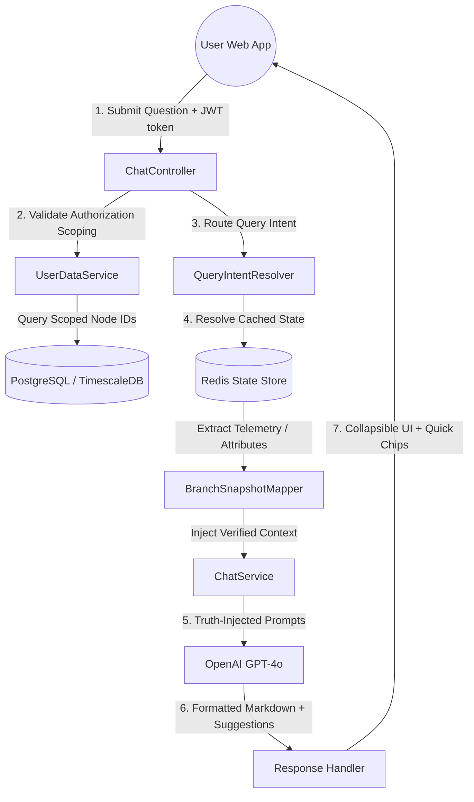

# 🤖 ThingsBoard AI IoT Assistant (SAI)

<div align="center">

[](https://github.com)
[](LICENSE)
[](https://github.com)
[](https://oracle.com/java)
[](https://spring.io)

## **Your IoT Data, Simplified. Ask. Analyze. Act. Done.**

Tired of navigating complex IoT dashboards? **We've built the "Siri" for your ThingsBoard network.**  
Real-time status reports, automated health checks, and intelligent security analysis — all through a simple chat interface.

---

### 🚀 Quick Navigation
- **[👥 I'm Not a Developer — Show me the overview](#part-1---for-everyone-)**
- **[⚙️ I'm a Developer — Show me the setup](#part-2---for-developers-)**

</div>

---

# 👥 PART 1 — FOR EVERYONE 🌍

*No coding knowledge required. Read this section in ~5 minutes.*

## Table of Contents (Part 1)
1. [What Is This Project?](#what-is-this-project)
2. [The Problem We Solve](#the-problem-we-solve)
3. [How It Works](#how-it-works-simple-explanation)
4. [Key Benefits](#key-benefits)
5. [Who Is This For?](#who-is-this-for)
6. [Live Demo & Screenshots](#live-demo--screenshots)
7. [Frequently Asked Questions](#frequently-asked-questions-non-technical)

---

## What Is This Project?

Imagine you manage a bank with 100 branches, each filled with cameras, alarm panels, and battery backups. To check if everything is working, you usually have to log into a complicated dashboard, click through 10 menus, and read rows of technical numbers.

**What if you could just ask your computer: "Are there any inactive branches?"**

That's exactly what we built. **SAI (Smart Assistant for IoT)** connects directly to your ThingsBoard platform and lets you talk to your facility data in plain English.

---

## The Problem We Solve

### The Current Situation

**For Security Managers:**
- ❌ Manually checking 100+ branches every morning is slow.
- ❌ Identifying "Offline" devices requires technical expertise.
- ❌ Finding a specific camera fault takes too many clicks.
- ❌ Historical data is hard to find and compare.

### Our Solution

We created a **Senior Security Analyst AI** that:
- ✅ Instantly identifies offline branches across your entire network.
- ✅ Explains complex sensor data (like battery voltage) in simple terms.
- ✅ Remembers your previous questions to provide detailed follow-ups.
- ✅ Anchors every answer to a specific branch so there's never confusion.
- ✅ Automatically suggests follow-up queries based on the current context.

---

## How It Works (Simple Explanation)

### Step-by-Step: From Question to Answer

```
1. YOU ASK A QUESTION
   → "What is the CCTV status of BALLY BAZAR?"

2. BOT FETCHES TRUTH
   → The bot reads the real-time sensor data from ThingsBoard / Redis.

3. BRAIN ANALYZES
   → The AI looks at the numbers (e.g., "2 of 16 cameras online").

4. PROFESSIONAL REPORT
   → SAI formats a clean response listing the offline cameras by channel:
     "For Branch BALLY BAZAR, CCTV Camera Status is 2 of 16 cameras ONLINE.
      Offline Cameras:
      - Channel 1: 24080129_003352-VMDS
      - CP-UNC-VC21L5C-VMD-LQ (7 units: Channels 5, 7-9, 12-13, 15)..."

5. INTERACTIVE CHIPS
   → SAI offers interactive suggestion chips:
     [What is the power status of BRANCH BALLY BAZAR?]
     [Are there any active alarms for BRANCH BALLY BAZAR?]
```

---

## Key Benefits

✅ **Save Time:** Get a full branch health report in 3 seconds instead of 10 minutes.  
✅ **Zero Learning Curve:** If you can send a chat message, you can use SAI.  
✅ **Strict Access Controls:** Scopes user data so users only see branches they are authorized to view (e.g., Regional/Zonal/Head Office users).  
✅ **Advanced Formatting:** Automatically aggregates similar device configurations (like identical model numbers) and lists them neatly with channel range grouping.  

---

## Who Is This For?

### 🏦 **Bank & Facility Managers**
Monitor security and hardware health across hundreds of remote locations from one window.

### 🛡️ **Security Operations Centers (SOC)**
Quickly identify which branch needs a physical maintenance visit without digging through logs.

### 👨‍🔧 **Maintenance Teams**
Ask "What is the HDD status?" before driving to a branch so you know exactly which part to bring.

---

## Live Demo & Screenshots

### 📸 Screenshots

**Screenshot 1: The Global Overview**
  
*See your entire bank network status in one sentence, with collapsible list sections.*

**Screenshot 2: Precision Reporting**
  
*Self-descriptive answers anchored to specific branch names with quick-reply recommendation chips.*

---

## Frequently Asked Questions (Non-Technical)

### 🔒 **Q: Is my data safe?**
**A:** Yes. SAI acts as a "Read-Only" analyst. It cannot change your device settings, and it enforces strict scoping based on your ThingsBoard credentials.

### 📱 **Q: Does it work on my phone?**
**A:** Yes! The chat widget works in any modern web browser on desktop, tablet, or smartphone.

---

# ⚙️ PART 2 — FOR DEVELOPERS 👨‍💻

*Complete technical documentation, setup guides, and architecture details.*

## Table of Contents (Part 2)
1. [Technical Overview](#technical-overview)
2. [Tech Stack](#tech-stack)
3. [System Architecture](#system-architecture)
4. [Scoping & Security](#scoping--security)
5. [Caching Mechanisms](#caching-mechanisms)
6. [CCTV Formatting & Channel-Range Grouping](#cctv-formatting--channel-range-grouping)
7. [Getting Started](#getting-started)
8. [Folder & File Structure](#folder--file-structure)
9. [Testing & Validation](#testing--validation)

---

## Technical Overview

### Architecture Pattern: **Truth-Injection Model (CAG)**

SAI is built as a **Context-Augmented Generation (CAG)** system. Unlike standard chatbots that "guess," SAI uses a deterministic backend to pre-calculate "Truth" before the AI ever sees it.

✅ **Ambiguity Filter:** Detects queries missing a target branch and requests clarification.  
✅ **Topic Retention:** Stores "Pending Intent" in session memory to handle context-heavy follow-ups.  
✅ **Scoping Enforcement:** Intercepts questions to prevent cross-customer or unauthorized branch access.  

---

## Tech Stack

| Category | Technology | Version | Purpose |
|----------|-----------|---------|---------|
| **Backend** | Java | 21 | Core Language |
| **Framework** | Spring Boot | 4.0.3 | Application Framework |
| **Database** | TimescaleDB / PostgreSQL | 15+ | Timeseries Event Database |
| **Cache Store**| Redis (Upstash) | 6.x / 7.x | High-Speed Active State Mirroring |
| **Queue Broker**| RabbitMQ | 3.x | Real-Time Events Ingestion Queue |
| **Frontend** | React, TypeScript, Vite | 5.x / 18.x | Dynamic Chat UI |
| **Build Tool** | Maven | 3.8+ | Dependency Management |
| **LLM Engine** | OpenAI | GPT-4o | Natural Language Processing |

---

## System Architecture



---

## Scoping & Security

SAI enforces strict multi-level tenancy scoping based on ThingsBoard user scopes (`HO`, `ZO`, `Regional`, `Branch` levels):
1. **Token Parsing:** Decodes client JWT claims to retrieve authorized customer IDs and regional properties.
2. **Access Intersection:** Filters all active branch snapshots against the user's scope nodes retrieved from TimescaleDB.
3. **Question Interception:** If a user queries details about an unauthorized branch name, the request is blocked and returned immediately as:
   `*Branch [Name] was not found, or you do not have permission to view it.*`

---

## Caching Mechanisms

To achieve response latencies under **200ms**, SAI employs a dual-layer caching strategy:
1. **Redis Cache Mirroring:** Telemetry and attribute changes from the RabbitMQ ingestion pipeline are mirrored directly into Redis hashes.
2. **Concurrent In-Memory JVM Caching:** Node hierarchy mappings and path lookups in TimescaleDB are cached within JVM memory with a **5-minute TTL** self-expiring model, completely eliminating query overhead on database connection pools.

---

## CCTV Formatting & Channel-Range Grouping

Offline CCTV camera listings parse raw JSON entries (`rock_CAMERAdETAILS`, `CAMERAdETAILS`, `CAMERA_DETAILS`), formatting them dynamically:
* **Channel Prefixing:** Renders entries as `Channel [No]: [Model/Name]`.
* **Channel Range Grouping:** Merges identical camera models or hashes, and compiles their channel numbers into compact sorted ranges (e.g. `CP-UNC-VC21L5C-VMD-LQ (7 units: Channels 5, 7-9, 12-13, 15)`).
* **Consistently Bulleted:** Lists offline cameras as bullet points below the status overview for superior readability.

---

## Getting Started

### Prerequisites
*   **Java 21** installed and configured in `PATH`.
*   **Node.js 18+** & **npm** (for compiling the frontend).
*   **OpenAI API Key** with GPT-4 access.
*   **ThingsBoard Credentials** or a running local setup.

### 1. Installation
```bash
git clone https://github.com/singhaganesh/ThingsBoard-Bot.git
cd ThingsBoard-Bot
```

### 2. Compile Frontend Assets
Build the React UI bundle and copy it directly to the Spring Boot static resource directory:
```bash
cd frontend
npm install
npm run build
cd ..
```

### 3. Configuration
Edit `src/main/resources/application-dev.properties`:
```properties
# ThingsBoard API
iotchatbot.thingsboard.url=https://seple.iot-private.cloud
iotchatbot.thingsboard.username=your_admin_email
iotchatbot.thingsboard.password=your_admin_password

# Database Settings
spring.datasource.url=jdbc:postgresql://your-timescaledb-host:32311/tsdb
spring.datasource.username=tsdbadmin
spring.datasource.password=your_db_password

# Redis Settings
spring.data.redis.host=your-upstash-redis-host
spring.data.redis.port=6379
spring.data.redis.password=your_redis_password
spring.data.redis.ssl.enabled=true

# OpenAI API Key
iotchatbot.openai.api-key=sk-your-key
```

### 4. Run the Bot (Dev & Chat Profiles)
```bash
./mvnw spring-boot:run "-Dspring-boot.run.profiles=dev,chat" "-Dspring-boot.run.arguments=--server.port=8083"
```

---

## Folder & File Structure

```
ThingsBoard-Bot/
├── frontend/                # React / TypeScript Vite Frontend UI
├── src/main/java/com/seple/ThingsBoard_Bot/
│   ├── client/              # OpenAI & ThingsBoard API Wrappers
│   ├── config/              # Security, Cache, RabbitMQ, and OpenAI Configs
│   ├── model/domain/        # Structured IoT Domain Objects (Branch, Power, CCTV)
│   ├── service/             # CORE SERVICES
│   │   ├── ChatService.java # Orchestrator (Scoping & LLM Prompting)
│   │   ├── UserDataService.java # Tenancy Scope Rules Engine
│   │   ├── normalization/   # Key mapping and Data Cleanup
│   │   └── query/           # Intent Resolution, Caching & Templates
│   └── util/                # Token Counting & Context Filtering
└── src/main/resources/static/ # Compiled static Frontend Assets
```

---

## Testing & Validation

SAI uses a **Golden Question** testing strategy to ensure 100% accuracy.

```bash
# Run all unit and integration tests
./mvnw test
```

**Key Test Areas:**
*   `QueryIntentResolverTest`: Validates that user questions map to correct metrics.
*   `DeterministicAnswerServiceTest`: Ensures "Truth-Injection" calculates correct counts and validates channel-range grouping layout rules.
*   `ChatServiceTest`: Verifies scope verification intercepts and JWT-scoping compliance.

---
*Developed by Ganesh Singha — Senior IoT Developer.*

