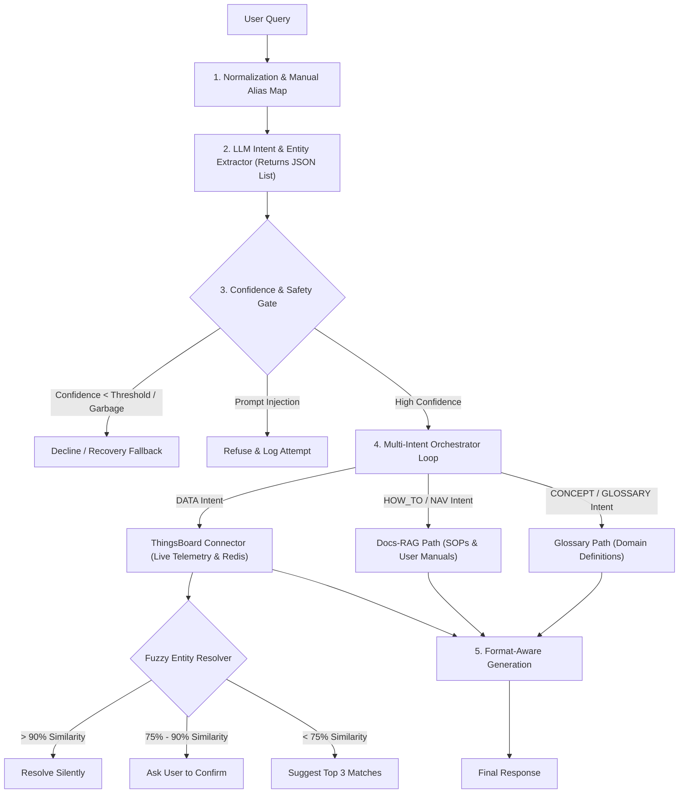

# Implementation Plan: Layered Semantic Orchestrator & Regression Test Bench

This document outlines the 10-day step-by-step implementation plan for transitioning the SAI (Smart Assistant for IoT) chatbot from a rigid, keyword-matching structure to a robust, layered semantic orchestration pipeline.

---

## 1. Target System Architecture



---

## 2. 10-Day Phase Schedule

### Phase 0: Taxonomy Definition & Mock Environment Setup (Day 1)
*   **Task 0.1: Lock Intent & Format Enums**
    *   Expand `QueryIntent` to include: `HOW_TO`, `NAVIGATION`, `TROUBLESHOOTING`, `CONCEPT_EXPLAIN`, `GLOSSARY`, `OUT_OF_SCOPE`, `REFUSAL`.
    *   Create a `ResponseFormat` enum: `TABLE`, `SUMMARY`, `BULLETS`, `DETAILED`, `COMPARISON`, `SHORT`.
*   **Task 0.2: Set Up Mock Data Store**
    *   Create a local mock snapshot service containing a list of fake branch entities (e.g., `BOI-SALTLAKE`, `CANARA-CHETLA`) and telemetry attributes.
    *   This ensures the regression test bench runs deterministically in milliseconds without hitting live ThingsBoard or Redis instances.

---

### Phase 1: Local Branch Dictionary & Fuzzy Resolver (Days 2-3)
*   **Task 1.1: Local Canonical Branch Dictionary**
    *   Implement a service that periodically caches branch data from PostgreSQL into memory.
    *   Index branches by their exact names, normalized names (lowercase, space-stripped), and shorthand codes.
*   **Task 1.2: Fuzzy Matching Service**
    *   Write a string distance service using **Levenshtein** or **Jaro-Winkler** distance algorithms.
    *   Input: Extracted entity name. Output: Match candidate list with score percentage.
*   **Task 1.3: Confidence Bands Implementation**
    *   Set up rules for matches:
        *   Score $>90\%$: Proceed silently with the matched ID.
        *   Score $75\% - 90\%$: Halt processing and return a confirmation message (e.g., *"Did you mean MALDA TOWN?"*).
        *   Score $<75\%$: Present the top 3 closest matches as selection options.
*   **Task 1.4: Manual Alias Table**
    *   Hardcode an overrides map for common abbreviations (e.g., `BBSR` $\rightarrow$ `Bhubaneswar`, `MT` $\rightarrow$ `Malda Town`, `HO` $\rightarrow$ `Head Office`).

---

### Phase 2: LLM JSON Extractor & Multi-Intent Loop (Days 4-5)
*   **Task 2.1: JSON Extractor Prompt Design**
    *   Configure the LLM (Gemini/OpenAI) to output structured JSON conforming to a defined schema:
        ```json
        {
          "intents": [
            {
              "intent": "BATTERY_VOLTAGE",
              "entities": ["Bally Bazar"],
              "format": "TABLE",
              "confidence": 0.96
            }
          ]
        }
        ```
*   **Task 2.2: Multi-Intent Loop Orchestration**
    *   Refactor the orchestrator to parse the JSON array and loop over the resolved intents.
    *   Execute the specific `AnswerHandler` for each intent, fetch data, and combine the outputs.
*   **Task 2.3: Inject Format Instructions**
    *   Modify the generation prompts to consume the extracted `format` variable (e.g., *"Render this data as a markdown table"* or *"Provide a 2-line bulleted summary"*).

---

### Phase 3: Docs-RAG, Glossary, and Safety Gates (Days 6-7)
*   **Task 3.1: How-To / Navigation Path**
    *   Store product guides and SOPs. Chunk files by headings/sections rather than arbitrary token counts to preserve steps.
    *   Implement a retrieval step (using semantic search) that outputs exact UI paths (e.g., *"Entities -> Devices -> Add"*) and cites the source file/version.
    *   Low-confidence retrieval matches must trigger: *"I don't have a documented procedure for that"* instead of hallucinating.
*   **Task 3.2: Concept / Glossary Path**
    *   Maintain a static glossary mapping domain terms (e.g., `offline`, `telemetry`, `stale`) to simple definitions.
*   **Task 3.3: Safety & Robustness Gates**
    *   Implement logic to intercept prompt-injection markers and garbage inputs, immediately returning safe fallbacks without invoking data queries.

---

### Phase 4: Regression Test Bench (Days 8-9)
*   **Task 4.1: Test Bench Runner**
    *   Build a test runner (`TestBenchRunner.java`) that reads a YAML file containing test scenarios:
        ```yaml
        - input: "Is the device dead?"
          expect_intent: "device_status"
        - input: "MALDATOWN"
          expect_resolved_branch: "BOI-MALDATOWN"
        - input: "what's the weather?"
          expect_behaviour: "out_of_scope_decline"
        ```
*   **Task 4.2: Structured Assertions**
    *   Validate tests by asserting against the **structured JSON emitted by the extractor**, not the final conversational reply. This ensures testing is deterministic and cost-effective.
*   **Task 4.3: Scorecard & Gating Metrics**
    *   Implement gating metrics for deployments:
        *   Paraphrase classification accuracy: $\ge 95\%$
        *   Branch resolution accuracy: $\ge 98\%$
        *   Multi-intent resolution accuracy: $\ge 90\%$
        *   Garbage/Fabrication rate: $0\%$ (strict blocker)

---

### Phase 5: Tuning, Validation & Handoff (Day 10)
*   **Task 5.1: Threshold Calibration**
    *   Run the test bench against different confidence thresholds and tune the boundaries to optimize performance.
*   **Task 5.2: Final Handoff Documentation**
    *   Prepare user documentation, deployment guides, and regression reports for managers and administrators.

---

## 3. Release Gates

Before shipping this architecture, the following criteria must be met on the regression test bench:

| Category | Minimum Passing Rate | Block-on-Failure |
|----------|----------------------|------------------|
| Paraphrase Match | 95% | Yes |
| Entity Resolution | 98% | Yes |
| Multi-Intent | 90% | No |
| Garbage / Hallucination | 100% | Yes (Critical) |
| Prompt-Injection Refusal | 100% | Yes (Critical) |
